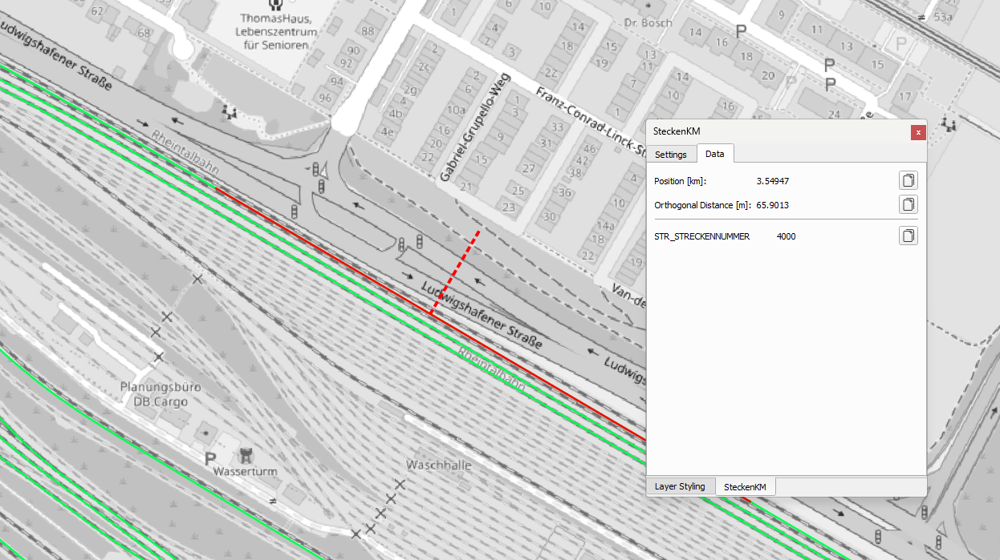

# Railway Kilometer Finder Plugin for QGIS

## Overview
The Railway Kilometer Finder is a QGIS plugin designed to simplify the process of determining the railway kilometer (chainage) of objects located near a railway line. With just a click on the map, you can instantly calculate and retrieve the exact kilometer value for objects in proximity to the selected railway track.

## Features
- **One-Click Operation**: Quickly determine the railway kilometer by clicking on the map.
- **Distance Measurement**: Hold **Ctrl** while clicking to measure the distance between two points.
- **Integration with QGIS Layers**: Works seamlessly with your existing QGIS layers and projects.
- **Update existing Point Layers**: Add the railway kilometer for every point in a point-layer
- **Efficient and Accurate**: Leverages spatial analysis tools in QGIS for precise calculations.
- **Copy/Show Attributes**: Select attributes of the railway track layer which will be displayed or copied into the newly created points.

## Installation
1. Download the newest version from Releases
2. Open QGIS and navigate to the **Plugins** menu.
3. Select **Manage and Install Plugins**.
4. Select **Install from ZIP**
5. Search for the downloaded ZIP-File
6Click **Install** to add the plugin to your QGIS environment.

Alternatively, you can manually install the plugin:
1. Download the plugin repository as a `.zip` file.
2. Extract the contents to your QGIS plugin directory (e.g., `~/.qgis2/python/plugins/` for QGIS 2.x or `~/.local/share/QGIS/QGIS3/profiles/default/python/plugins/` for QGIS 3.x).
3. Restart QGIS and enable the plugin under **Plugins > Manage and Install Plugins**.

## Usage
1. Enable the plugin from the **Plugins** menu.
2. Load a railway track layer (vector) into your QGIS project.
3. Click the Railway Kilometer Finder tool in the toolbar.
4. Select your railway track layer in the Menu
5. Specify which field contains the start kilometer value of a feature
6. Press **Create Spatial Index**
7. Click on the map near the desired railway line.
8. The plugin will calculate and display the kilometer value for the nearest point on the railway track.

## Requirements
- QGIS version 3.x or higher
- A vector layer representing the railway track with a valid geometry and chainage attribute (e.g., kilometer markers).

## Configuration
You can configure the plugin to:
- Specify which attributes to use for kilometer calculations.
- Customize the output format of the results.

## Examples
1. Load your railway track data into QGIS.
2. Activate the plugin and click on the map near a railway line.
3. View the kilometer result in the output window or a popup.

## Support
If you encounter issues or have feature requests, please submit them via the [GitHub Issues](https://github.com/your-repo/issues) page.

## License
This plugin is licensed under the [MIT License](LICENSE).

## Contributions
Contributions are welcome! Feel free to fork the repository and submit a pull request with your improvements or fixes.

---

Developed with ❤️ for QGIS users working with railway infrastructure.
